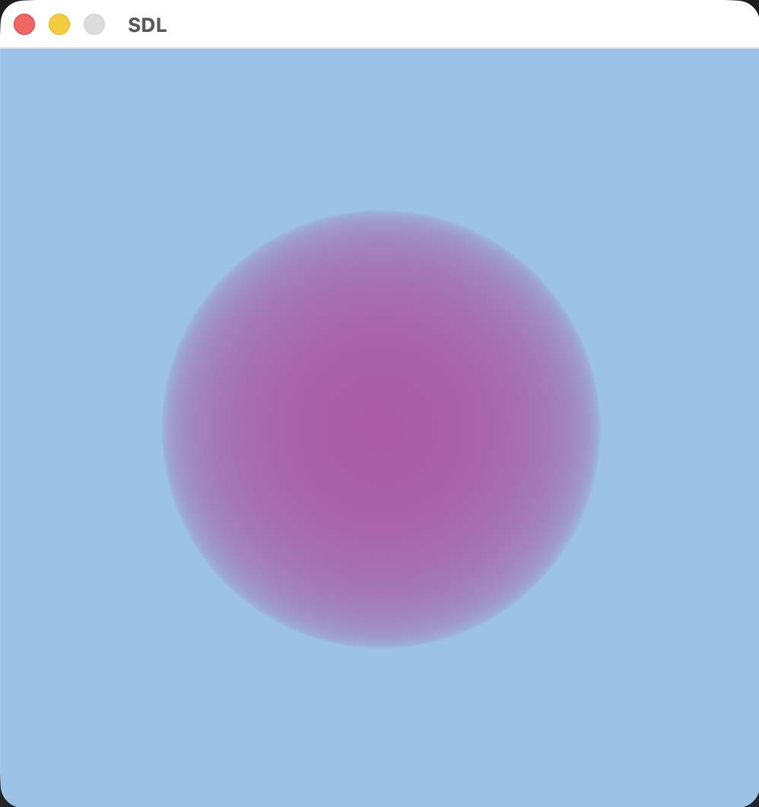
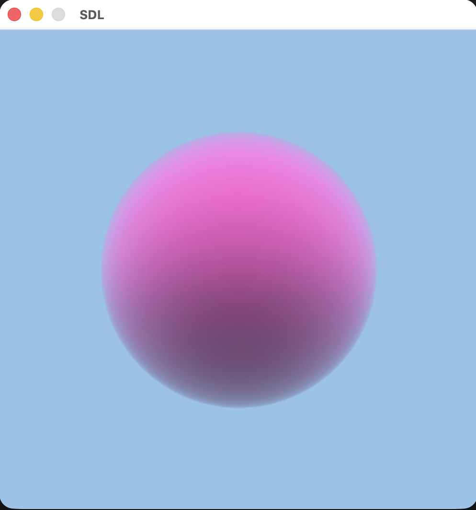
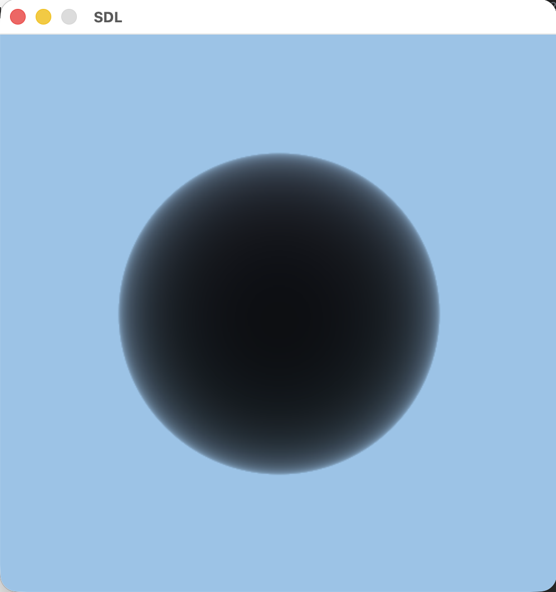
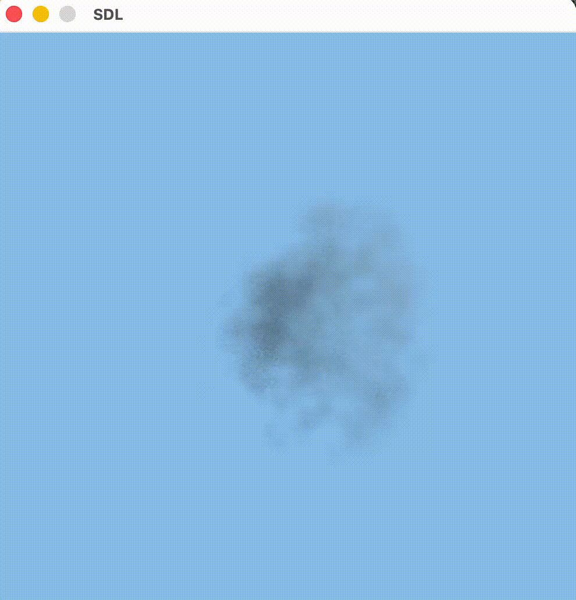
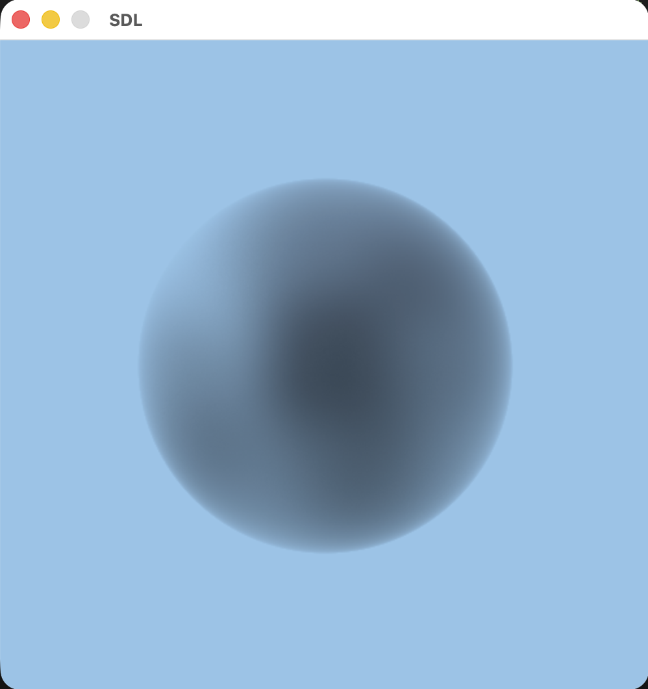

# Ray Marching

> Implementation of basic **volume rendering techniques** based on the tutorials from **Scratchapixel**.

---

## 📁 Chapters Overview

### Chapter 0 — Constant Density Sphere

Introduction to ray marching inside a volume with uniform density.

* **Ray Marching** — Sampling points along camera rays inside a sphere.
* **Constant Density** — Uniform medium without variation.
* **Basic Accumulation** — Integrating density along the ray.

  

---

### Chapter 1 — Lighting & Transmittance

Adds light interaction and attenuation inside the medium.

* **Beer–Lambert Law** — Light absorption through the medium.
* **Transmittance** — Exponential falloff of light.
* **Single Scattering** — Light contribution accumulated along the ray.

  

---

### Chapter 2 — Phase Function

Simulates how light is scattered inside the volume.

* **Isotropic Scattering** — Light scatters equally in all directions.
* **View-dependent Brightness** — Intensity varies with viewing angle.
* **Dark Core Effect** — Reduced light reaching deeper regions.

 
   

---

### Chapter 4 — Animation

Moves from constant density to spatially varying density and adds temporal variation to the density field.

* **Rotating Density Field** — Density sampled in transformed space.
* **Frame-based Animation** — Density evolves over time.
* **Dynamic Volumes** — Simulates motion like smoke or clouds.
* **Procedural Density** — Density defined using noise.
* **Fractal Brownian Motion (FBM)** — Multi-octave noise for natural patterns.
* **Falloff Function** — Smooth transition at volume boundaries.

  
  

---

## Credits

This project is based on the tutorials from:

👉 https://www.scratchapixel.com/

---

